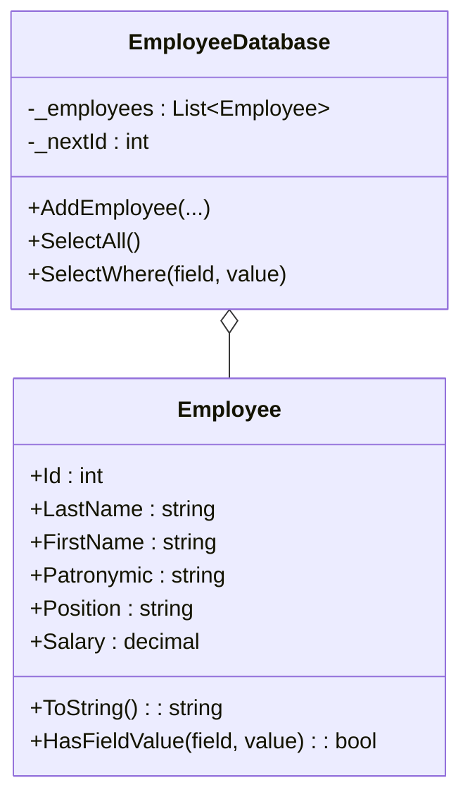

# База данных сотрудников автобусного парка (C#)

## Описание

Консольное приложение-имитатор базы данных сотрудников автобусного парка.  
**Без использования настоящих БД** (все хранится в памяти).  
Работает с командами пользователя: добавление, выборка всех и выборка по критерию.

## Структура

- **Employee** — класс сотрудника (id, фамилия, имя, отчество, должность, зарплата).
- **EmployeeDatabase** — хранит список сотрудников, реализует команды.
- **Program** — консольный интерфейс для пользователя.

## Пример команд

```
ADD(Иванов, Иван, Иванович, водитель, 50000);
ADD(Петрова, Мария, Сергеевна, диспетчер, 47000);
SELECT *;
SELECT id=0;
SELECT lastname=Петрова;
SELECT position=водитель;
SELECT salary=47000;
```

## Синтаксис команд

- `ADD(Фамилия, Имя, Отчество, Должность, Зарплата);` — добавить сотрудника (id присваивается автоматически)
- `SELECT *;` — вывести всех сотрудников
- `SELECT поле=значение;` — вывести всех сотрудников, у кого `поле` совпадает с `значение`  
  (поле: id, lastname, firstname, patronymic, position, salary)

## Пример вывода

```
ID: 0 | Иванов Иван Иванович | Должность: водитель | Зарплата: 50000 руб.
ID: 1 | Петрова Мария Сергеевна | Должность: диспетчер | Зарплата: 47000 руб.
```

## Диаграмма классов



## Как запустить

1. Скомпилируйте:
   ```
   csc Program.cs EmployeeDatabase.cs Employee.cs
   ```
2. Запустите:
   ```
   Program.exe
   ```

---